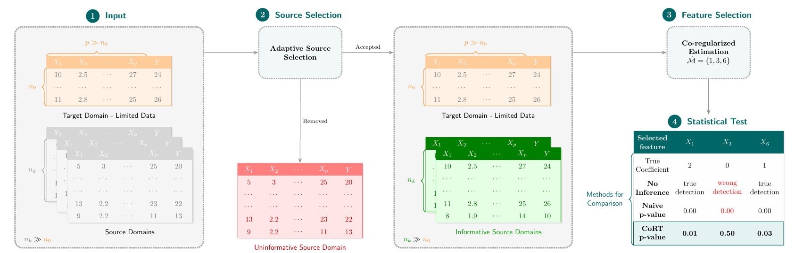
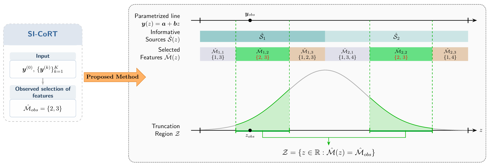

# Adaptive CoRT-SI

Adaptive CoRT-SI is a Python package for selective inference after Adaptive CoRT in high-dimensional regression. The repository focuses on exact post-selection p-values for the target model while keeping the implementation close to the mathematical pipeline described in the paper draft.

The public entry points are exported from the package root:

```python
from cort_si import SI, SI_randj
```

`SI(...)` returns `(feature_index, selective_p_value)` pairs for the selected target features, and `SI_randj(...)` returns one selective p-value for a randomly chosen selected target feature.

## Method Overview

Adaptive CoRT-SI combines an adaptive source-selection stage with selective inference for the final CoRT model. The repository is organized so that the source-selection logic, the model-selection region computations, and the public inference API remain separate but lightweight.



To compute valid p-values, the method identifies the truncation region where both the source-selection event and the final model-selection event remain unchanged. The implementation uses a divide-and-conquer style line search over $z$ together with interval intersection routines.



## Features

- Exact selective p-values for Adaptive CoRT target features.
- Adaptive source selection with majority voting across target folds.
- Interval-based characterization of both source-selection and model-selection events.
- Installable Python package with a small public API.

## Installation

The package requires Python 3.9+ and the following libraries:

- [numpy](https://numpy.org/doc/stable/)
- [scipy](https://docs.scipy.org/doc/)
- [mpmath](https://mpmath.org/)
- [skglm](https://contrib.scikit-learn.org/skglm/)
- [matplotlib](https://matplotlib.org/)
- [statsmodels](https://www.statsmodels.org/stable/index.html)

Install from source in editable mode:

```bash
git clone https://github.com/maTiahK/CORT_SI.git
cd CORT_SI
pip install -e .
```

## Package Structure

```text
CORT_SI/
├── cort_si/                        # Source package
│   ├── __init__.py                 # Package exports
│   ├── CORT_SI.py                  # Public inference entry points
│   ├── algorithms.py               # Adaptive CoRT estimators and selection logic
│   ├── sub_prob.py                 # Interval solvers for selection events
│   ├── gen_data.py                 # Synthetic data generation
│   ├── utils.py                    # Shared helpers and interval algebra
├── examples/                       # Runnable examples
│   ├── ex1_p_value_CORT.ipynb      # Main p-value demo notebook
│   └── ex2_pivot_CORT.ipynb        # Pivot validation notebook
├── figures/                        # README figures
├── pyproject.toml                  # Package installation config
└── README.md
```

## Quick Start

Start from the example notebooks in `examples/`:

- `examples/ex1_p_value_CORT.ipynb` computes selective p-values for the selected target features and includes a random-feature example with `SI_randj(...)`.
- `examples/ex2_pivot_CORT.ipynb` runs a null-model pivot uniformity check for Adaptive CoRT-SI.

## Examples

The repository currently ships with two user-facing example notebooks:

- `examples/ex1_p_value_CORT.ipynb` for computing selective p-values for all selected target features, plus a random-feature case with `SI_randj(...)`.
- `examples/ex2_pivot_CORT.ipynb` for a null-model pivot uniformity check.
